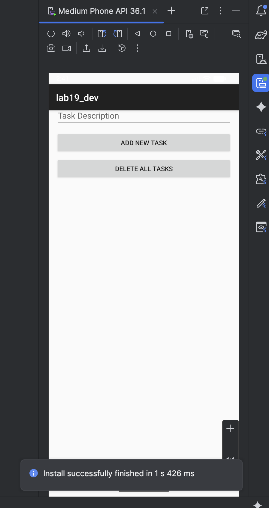
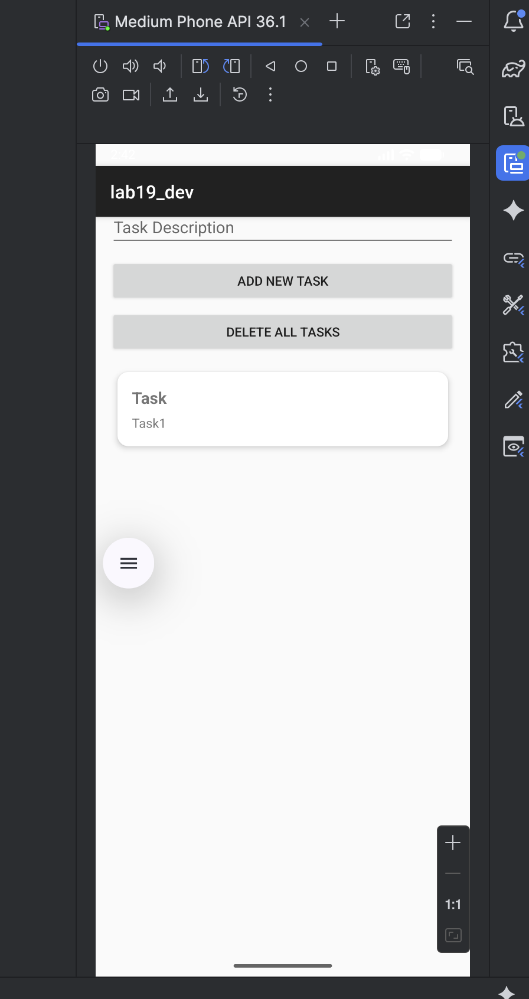
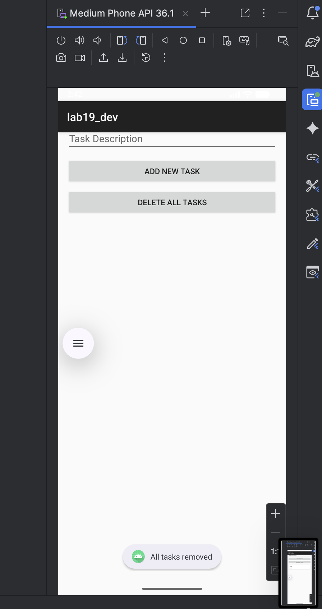

# LAB 19 – Room + MVVM : Gestion de tâches avec persistance locale 📱

## Aperçu de l'application

Une application Android de gestion de tâches qui implémente l'architecture MVVM (Model-View-ViewModel) avec persistance des données via Room (SQLite). L'application permet d'ajouter des tâches avec titre et description, de supprimer une tâche par clic long, et de supprimer toutes les tâches. Les données sont conservées même après la fermeture de l'application.

| Écran initial | Ajout d'une tâche | Suppression de toutes les tâches |
|---------------|-------------------|----------------------------------|
|  |  |  |

## Fonctionnalités

- **Ajout de tâche** : champ titre + champ description + bouton d'ajout
- **Affichage en liste** : RecyclerView avec CardView pour chaque tâche
- **Suppression individuelle** : clic long sur une tâche
- **Suppression massive** : bouton "DELETE ALL TASKS"
- **Persistance Room** : stockage local dans base SQLite
- **Observation LiveData** : mise à jour automatique de l'interface
- **Survie à la rotation** : le ViewModel conserve l'état lors du changement d'orientation

## Architecture MVVM utilisée

```
┌─────────────────────────────────────────────────────────────┐
│                         UI Layer                            │
│  ┌─────────────────┐              ┌─────────────────────┐  │
│  │  MainActivity   │◄────────────►│    TaskAdapter      │  │
│  │     (View)      │              │  (RecyclerView)     │  │
│  └────────┬────────┘              └─────────────────────┘  │
└───────────┼─────────────────────────────────────────────────┘
            │ observe LiveData
            ▼
┌─────────────────────────────────────────────────────────────┐
│                       ViewModel Layer                       │
│  ┌─────────────────────────────────────────────────────┐   │
│  │              TaskViewModel                          │   │
│  │         (AndroidViewModel + LiveData)               │   │
│  └────────────────────────┬────────────────────────────┘   │
└───────────────────────────┼────────────────────────────────┘
                            │
                            ▼
┌─────────────────────────────────────────────────────────────┐
│                       Repository Layer                      │
│  ┌─────────────────────────────────────────────────────┐   │
│  │              TaskRepository                         │   │
│  │    (Thread management + Data coordination)          │   │
│  └────────────────────────┬────────────────────────────┘   │
└───────────────────────────┼────────────────────────────────┘
                            │
                            ▼
┌─────────────────────────────────────────────────────────────┐
│                      Data Layer (Room)                      │
│  ┌─────────────┐  ┌─────────────┐  ┌─────────────────────┐ │
│  │ TaskEntity  │  │  TaskDao    │  │   TaskDatabase      │ │
│  │  (@Entity)  │  │   (@Dao)    │  │  (@Database)        │ │
│  └─────────────┘  └─────────────┘  └─────────────────────┘ │
└─────────────────────────────────────────────────────────────┘
```

## Structure du projet

```
lab19_dev/
├── app/src/main/
│   ├── java/com.example.lab19_dev/
│   │   ├── data/
│   │   │   ├── local/
│   │   │   │   ├── TaskEntity.java
│   │   │   │   ├── TaskDao.java
│   │   │   │   └── TaskDatabase.java
│   │   │   └── TaskRepository.java
│   │   ├── ui/
│   │   │   ├── MainActivity.java
│   │   │   └── TaskAdapter.java
│   │   └── viewmodel/
│   │       └── TaskViewModel.java
│   └── res/
│       ├── layout/
│       │   ├── activity_main.xml
│       │   └── task_item.xml
│       └── values/
```

## Code source complet

### 1. Dépendances – `build.gradle` (Module: app)

```groovy
plugins {
    id 'com.android.application'
}

android {
    namespace 'com.example.lab19_dev'
    compileSdk 34

    defaultConfig {
        applicationId "com.example.lab19_dev"
        minSdk 24
        targetSdk 34
        versionCode 1
        versionName "1.0"
    }

    compileOptions {
        sourceCompatibility JavaVersion.VERSION_1_8
        targetCompatibility JavaVersion.VERSION_1_8
    }
}

dependencies {
    implementation 'androidx.appcompat:appcompat:1.7.0'
    implementation 'com.google.android.material:material:1.12.0'
    
    def room_version = "2.8.4"
    def lifecycle_version = "2.9.3"
    
    implementation "androidx.room:room-runtime:$room_version"
    annotationProcessor "androidx.room:room-compiler:$room_version"
    implementation "androidx.room:room-livedata:$room_version"
    
    implementation "androidx.lifecycle:lifecycle-viewmodel:$lifecycle_version"
    implementation "androidx.lifecycle:lifecycle-livedata:$lifecycle_version"
    
    implementation "androidx.recyclerview:recyclerview:1.4.0"
    implementation "androidx.cardview:cardview:1.0.0"
}
```

### 2. Entity – `TaskEntity.java`

```java
package com.example.lab19_dev.data.local;

import androidx.room.Entity;
import androidx.room.PrimaryKey;

@Entity(tableName = "tasks_table")
public class TaskEntity {

    @PrimaryKey(autoGenerate = true)
    private int itemId;

    private String itemTitle;
    private String itemDescription;

    public TaskEntity(String itemTitle, String itemDescription) {
        this.itemTitle = itemTitle;
        this.itemDescription = itemDescription;
    }

    public int getItemId() {
        return itemId;
    }

    public void setItemId(int itemId) {
        this.itemId = itemId;
    }

    public String getItemTitle() {
        return itemTitle;
    }

    public String getItemDescription() {
        return itemDescription;
    }
}
```

### 3. DAO – `TaskDao.java`

```java
package com.example.lab19_dev.data.local;

import androidx.lifecycle.LiveData;
import androidx.room.Dao;
import androidx.room.Delete;
import androidx.room.Insert;
import androidx.room.Query;
import java.util.List;

@Dao
public interface TaskDao {

    @Insert
    void insertTask(TaskEntity task);

    @Delete
    void deleteTask(TaskEntity task);

    @Query("DELETE FROM tasks_table")
    void eraseAllTasks();

    @Query("SELECT * FROM tasks_table ORDER BY itemId DESC")
    LiveData<List<TaskEntity>> fetchAllTasks();
}
```

### 4. Database – `TaskDatabase.java`

```java
package com.example.lab19_dev.data.local;

import android.content.Context;
import androidx.room.Database;
import androidx.room.Room;
import androidx.room.RoomDatabase;

@Database(entities = {TaskEntity.class}, version = 1, exportSchema = false)
public abstract class TaskDatabase extends RoomDatabase {

    public abstract TaskDao taskDao();

    private static volatile TaskDatabase databaseInstance;

    public static TaskDatabase getDatabaseInstance(Context context) {
        if (databaseInstance == null) {
            synchronized (TaskDatabase.class) {
                if (databaseInstance == null) {
                    databaseInstance = Room.databaseBuilder(
                                    context.getApplicationContext(),
                                    TaskDatabase.class,
                                    "tasks_database"
                            )
                            .fallbackToDestructiveMigration()
                            .build();
                }
            }
        }
        return databaseInstance;
    }
}
```

### 5. Repository – `TaskRepository.java`

```java
package com.example.lab19_dev.data;

import android.app.Application;
import androidx.lifecycle.LiveData;
import com.example.lab19_dev.data.local.TaskDao;
import com.example.lab19_dev.data.local.TaskDatabase;
import com.example.lab19_dev.data.local.TaskEntity;
import java.util.List;
import java.util.concurrent.ExecutorService;
import java.util.concurrent.Executors;

public class TaskRepository {

    private final TaskDao taskDao;
    private final LiveData<List<TaskEntity>> allTasks;
    private final ExecutorService backgroundExecutor;

    public TaskRepository(Application application) {
        TaskDatabase database = TaskDatabase.getDatabaseInstance(application);
        taskDao = database.taskDao();
        allTasks = taskDao.fetchAllTasks();
        backgroundExecutor = Executors.newSingleThreadExecutor();
    }

    public void addTask(TaskEntity task) {
        backgroundExecutor.execute(() -> taskDao.insertTask(task));
    }

    public void removeTask(TaskEntity task) {
        backgroundExecutor.execute(() -> taskDao.deleteTask(task));
    }

    public void clearAllTasks() {
        backgroundExecutor.execute(taskDao::eraseAllTasks);
    }

    public LiveData<List<TaskEntity>> getAllTasks() {
        return allTasks;
    }
}
```

### 6. ViewModel – `TaskViewModel.java`

```java
package com.example.lab19_dev.viewmodel;

import android.app.Application;
import androidx.annotation.NonNull;
import androidx.lifecycle.AndroidViewModel;
import androidx.lifecycle.LiveData;
import com.example.lab19_dev.data.TaskRepository;
import com.example.lab19_dev.data.local.TaskEntity;
import java.util.List;

public class TaskViewModel extends AndroidViewModel {

    private final TaskRepository taskRepository;
    private final LiveData<List<TaskEntity>> allTasks;

    public TaskViewModel(@NonNull Application application) {
        super(application);
        taskRepository = new TaskRepository(application);
        allTasks = taskRepository.getAllTasks();
    }

    public void addNewTask(TaskEntity task) {
        taskRepository.addTask(task);
    }

    public void deleteExistingTask(TaskEntity task) {
        taskRepository.removeTask(task);
    }

    public void deleteAllExistingTasks() {
        taskRepository.clearAllTasks();
    }

    public LiveData<List<TaskEntity>> observeAllTasks() {
        return allTasks;
    }
}
```

### 7. Layout principal – `activity_main.xml`

```xml
<?xml version="1.0" encoding="utf-8"?>
<LinearLayout xmlns:android="http://schemas.android.com/apk/res/android"
    android:layout_width="match_parent"
    android:layout_height="match_parent"
    android:orientation="vertical"
    android:padding="16dp">

    <EditText
        android:id="@+id/inputTitle"
        android:layout_width="match_parent"
        android:layout_height="wrap_content"
        android:hint="Task Title"
        android:inputType="textCapSentences" />

    <EditText
        android:id="@+id/inputDescription"
        android:layout_width="match_parent"
        android:layout_height="wrap_content"
        android:layout_marginTop="8dp"
        android:hint="Task Description"
        android:inputType="textCapSentences|textMultiLine" />

    <Button
        android:id="@+id/addButton"
        android:layout_width="match_parent"
        android:layout_height="wrap_content"
        android:layout_marginTop="12dp"
        android:text="ADD NEW TASK" />

    <Button
        android:id="@+id/eraseAllButton"
        android:layout_width="match_parent"
        android:layout_height="wrap_content"
        android:layout_marginTop="8dp"
        android:text="DELETE ALL TASKS" />

    <androidx.recyclerview.widget.RecyclerView
        android:id="@+id/taskRecyclerView"
        android:layout_width="match_parent"
        android:layout_height="0dp"
        android:layout_marginTop="12dp"
        android:layout_weight="1" />

</LinearLayout>
```

### 8. Layout item – `task_item.xml`

```xml
<?xml version="1.0" encoding="utf-8"?>
<androidx.cardview.widget.CardView xmlns:android="http://schemas.android.com/apk/res/android"
    xmlns:app="http://schemas.android.com/apk/res-auto"
    android:layout_width="match_parent"
    android:layout_height="wrap_content"
    android:layout_margin="8dp"
    app:cardCornerRadius="12dp"
    app:cardElevation="4dp">

    <LinearLayout
        android:layout_width="match_parent"
        android:layout_height="wrap_content"
        android:orientation="vertical"
        android:padding="16dp">

        <TextView
            android:id="@+id/displayTitle"
            android:layout_width="match_parent"
            android:layout_height="wrap_content"
            android:text="Task Title"
            android:textSize="18sp"
            android:textStyle="bold" />

        <TextView
            android:id="@+id/displayDescription"
            android:layout_width="match_parent"
            android:layout_height="wrap_content"
            android:layout_marginTop="6dp"
            android:text="Task Description"
            android:textSize="14sp" />

    </LinearLayout>

</androidx.cardview.widget.CardView>
```

### 9. Adapter – `TaskAdapter.java`

```java
package com.example.lab19_dev.ui;

import android.view.LayoutInflater;
import android.view.View;
import android.view.ViewGroup;
import android.widget.TextView;
import androidx.annotation.NonNull;
import androidx.recyclerview.widget.RecyclerView;
import com.example.lab19_dev.R;
import com.example.lab19_dev.data.local.TaskEntity;
import java.util.ArrayList;
import java.util.List;

public class TaskAdapter extends RecyclerView.Adapter<TaskAdapter.TaskViewHolder> {

    private List<TaskEntity> taskList = new ArrayList<>();
    private ItemClickCallback clickCallback;
    private ItemLongClickCallback longClickCallback;

    public interface ItemClickCallback {
        void onItemClicked(TaskEntity task);
    }

    public interface ItemLongClickCallback {
        void onItemLongClicked(TaskEntity task);
    }

    public void updateTaskList(List<TaskEntity> tasks) {
        this.taskList = tasks;
        notifyDataSetChanged();
    }

    public void setClickCallback(ItemClickCallback callback) {
        this.clickCallback = callback;
    }

    public void setLongClickCallback(ItemLongClickCallback callback) {
        this.longClickCallback = callback;
    }

    @NonNull
    @Override
    public TaskViewHolder onCreateViewHolder(@NonNull ViewGroup parent, int viewType) {
        View itemView = LayoutInflater.from(parent.getContext())
                .inflate(R.layout.task_item, parent, false);
        return new TaskViewHolder(itemView);
    }

    @Override
    public void onBindViewHolder(@NonNull TaskViewHolder holder, int position) {
        TaskEntity currentTask = taskList.get(position);
        holder.titleText.setText(currentTask.getItemTitle());
        holder.descriptionText.setText(currentTask.getItemDescription());
    }

    @Override
    public int getItemCount() {
        return taskList.size();
    }

    class TaskViewHolder extends RecyclerView.ViewHolder {
        private final TextView titleText;
        private final TextView descriptionText;

        public TaskViewHolder(@NonNull View itemView) {
            super(itemView);
            titleText = itemView.findViewById(R.id.displayTitle);
            descriptionText = itemView.findViewById(R.id.displayDescription);

            itemView.setOnClickListener(v -> {
                int position = getAdapterPosition();
                if (clickCallback != null && position != RecyclerView.NO_POSITION) {
                    clickCallback.onItemClicked(taskList.get(position));
                }
            });

            itemView.setOnLongClickListener(v -> {
                int position = getAdapterPosition();
                if (longClickCallback != null && position != RecyclerView.NO_POSITION) {
                    longClickCallback.onItemLongClicked(taskList.get(position));
                    return true;
                }
                return false;
            });
        }
    }
}
```

### 10. MainActivity – `MainActivity.java`

```java
package com.example.lab19_dev.ui;

import android.os.Bundle;
import android.widget.Button;
import android.widget.EditText;
import android.widget.Toast;
import androidx.appcompat.app.AppCompatActivity;
import androidx.lifecycle.ViewModelProvider;
import androidx.recyclerview.widget.LinearLayoutManager;
import androidx.recyclerview.widget.RecyclerView;
import com.example.lab19_dev.R;
import com.example.lab19_dev.data.local.TaskEntity;
import com.example.lab19_dev.viewmodel.TaskViewModel;

public class MainActivity extends AppCompatActivity {

    private TaskViewModel taskViewModel;
    private EditText titleInput;
    private EditText descriptionInput;
    private Button addTaskButton;
    private Button deleteAllButton;
    private TaskAdapter taskAdapter;

    @Override
    protected void onCreate(Bundle savedInstanceState) {
        super.onCreate(savedInstanceState);
        setContentView(R.layout.activity_main);

        initializeViews();
        setupRecyclerView();
        setupViewModel();
        observeTaskChanges();
        setupClickListeners();
    }

    private void initializeViews() {
        titleInput = findViewById(R.id.inputTitle);
        descriptionInput = findViewById(R.id.inputDescription);
        addTaskButton = findViewById(R.id.addButton);
        deleteAllButton = findViewById(R.id.eraseAllButton);
    }

    private void setupRecyclerView() {
        RecyclerView recyclerView = findViewById(R.id.taskRecyclerView);
        recyclerView.setLayoutManager(new LinearLayoutManager(this));
        recyclerView.setHasFixedSize(true);
        taskAdapter = new TaskAdapter();
        recyclerView.setAdapter(taskAdapter);
    }

    private void setupViewModel() {
        taskViewModel = new ViewModelProvider(this).get(TaskViewModel.class);
    }

    private void observeTaskChanges() {
        taskViewModel.observeAllTasks().observe(this, tasks -> {
            taskAdapter.updateTaskList(tasks);
        });
    }

    private void setupClickListeners() {
        addTaskButton.setOnClickListener(v -> addNewTask());
        
        deleteAllButton.setOnClickListener(v -> {
            taskViewModel.deleteAllExistingTasks();
            Toast.makeText(this, "All tasks removed", Toast.LENGTH_SHORT).show();
        });

        taskAdapter.setLongClickCallback(task -> {
            taskViewModel.deleteExistingTask(task);
            Toast.makeText(this, "Task deleted: " + task.getItemTitle(), Toast.LENGTH_SHORT).show();
        });

        taskAdapter.setClickCallback(task -> {
            Toast.makeText(this, "Selected: " + task.getItemTitle(), Toast.LENGTH_SHORT).show();
        });
    }

    private void addNewTask() {
        String taskTitle = titleInput.getText().toString().trim();
        String taskDescription = descriptionInput.getText().toString().trim();

        if (taskTitle.isEmpty() || taskDescription.isEmpty()) {
            Toast.makeText(this, "Please fill both title and description", Toast.LENGTH_SHORT).show();
            return;
        }

        TaskEntity newTask = new TaskEntity(taskTitle, taskDescription);
        taskViewModel.addNewTask(newTask);

        titleInput.setText("");
        descriptionInput.setText("");
        Toast.makeText(this, "Task added successfully", Toast.LENGTH_SHORT).show();
    }
}
```

## Comment exécuter l'application

1. **Créer un projet** Android Studio avec "Empty Views Activity"
2. **Nom du projet** : `lab19_dev`
3. **Langage** : Java
4. **API minimum** : 24 (Android 7.0)
5. **Ajouter les dépendances** dans `build.gradle` (Module: app)
6. **Créer la structure de packages** comme indiqué ci-dessus
7. **Créer tous les fichiers** avec leur contenu respectif
8. **Compiler** et exécuter sur émulateur ou appareil physique

## Fonctionnement détaillé

| Action | Résultat |
|--------|----------|
| Remplir titre + description + clic "ADD NEW TASK" | La tâche apparaît immédiatement dans la liste |
| Clic court sur une tâche | Affiche un Toast avec le titre de la tâche |
| Clic long sur une tâche | Supprime la tâche de la liste et de la base |
| Clic "DELETE ALL TASKS" | Supprime toutes les tâches |
| Rotation de l'écran | La liste reste intacte (ViewModel) |
| Fermeture complète + réouverture | Les tâches sont toujours présentes (Room) |

## Points techniques abordés

### Architecture MVVM
- **Entity** : `@Entity` + `@PrimaryKey` – structure de la table SQLite
- **DAO** : `@Dao`, `@Insert`, `@Delete`, `@Query` – interface d'accès aux données
- **RoomDatabase** : `@Database` + singleton – point central SQLite
- **Repository** : couche intermédiaire + `ExecutorService` pour threads
- **ViewModel** : `AndroidViewModel` + `LiveData` – logique UI + survie à la rotation
- **LiveData** : observation automatique respectant le cycle de vie

### Composants UI
- **RecyclerView** : affichage performant avec ViewHolder
- **CardView** : rendu moderne des tâches
- **LinearLayoutManager** : disposition verticale

### Threading
- **ExecutorService** : opérations Room hors thread principal
- **newSingleThreadExecutor()** : file d'attente séquentielle

### Pourquoi pas d'opérations Room sur le thread principal ?
Room interdit les opérations sur le thread UI par défaut. Le Repository utilise `ExecutorService` pour exécuter les insertions/suppressions en arrière-plan, garantissant ainsi une interface fluide.

### Ce que ViewModel résout réellement
- ✅ Survie à la rotation d'écran
- ✅ Survie aux changements de configuration
- ✅ Conservation de l'état lors de la recréation de l'Activity

### Limite connue
Le ViewModel ne survit pas à un "process death" (fermeture par le système). Pour cela, il faudrait ajouter le module **Saved State for ViewModel**.

## Tests à réaliser

| Test | Procédure | Résultat attendu |
|------|-----------|------------------|
| Insertion | Ajouter 3 tâches | Les 3 tâches s'affichent |
| Suppression | Clic long sur une tâche | La tâche disparaît |
| Persistance | Fermer et rouvrir l'app | Les tâches sont toujours là |
| Rotation | Ajouter une tâche + rotation | La liste reste cohérente |
| Suppression totale | Clic "DELETE ALL TASKS" | Liste vide |

---

**Auteur** : ELHEZZAM RANIA  
**Réalisé avec** : Android Studio sur MacOS Apple Silicon M2 (ARM-64 Native)  
